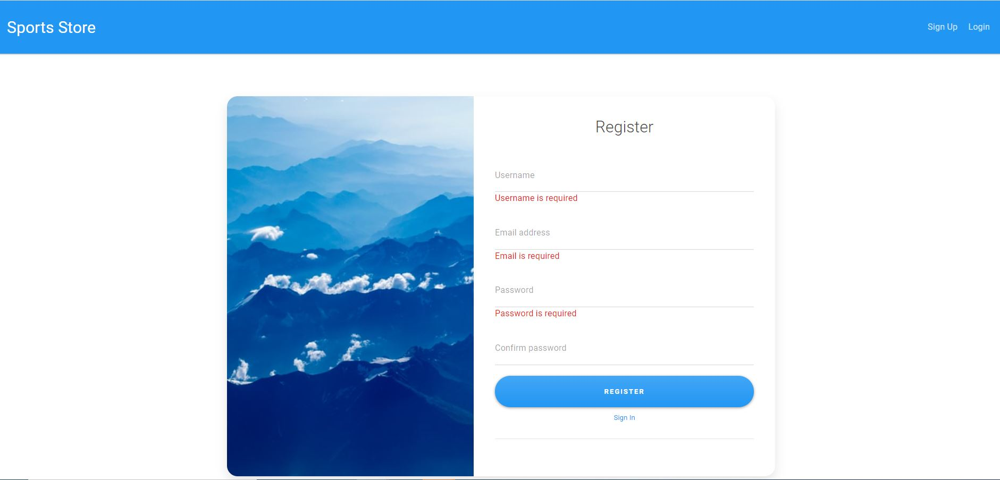
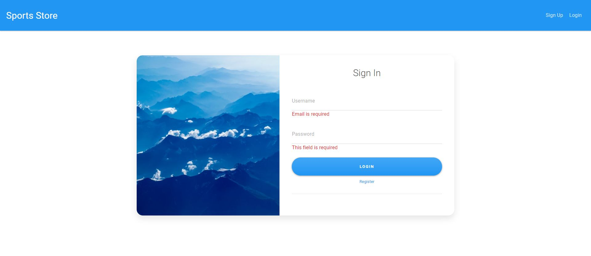
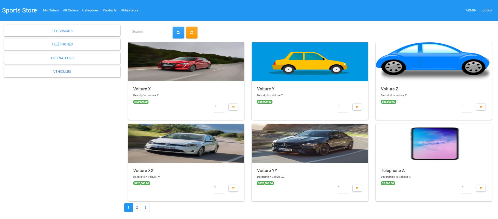
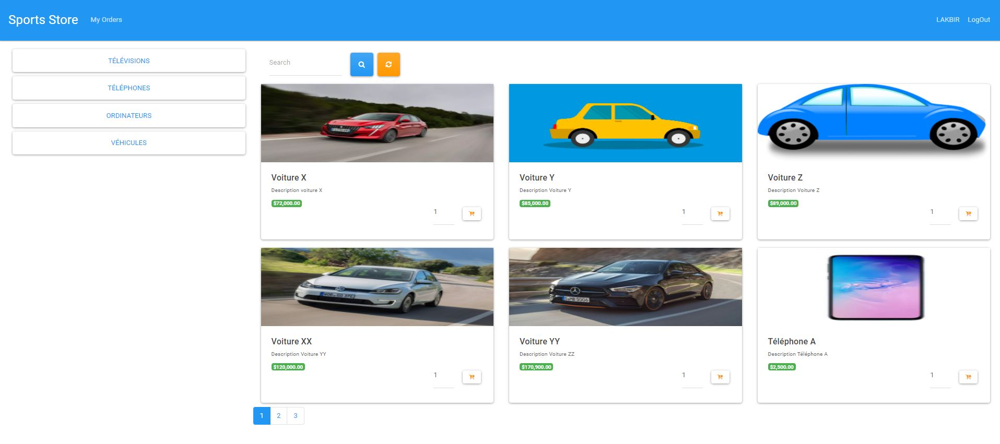
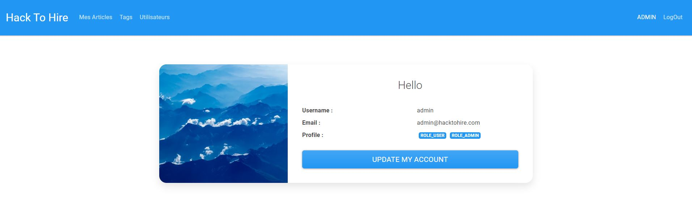
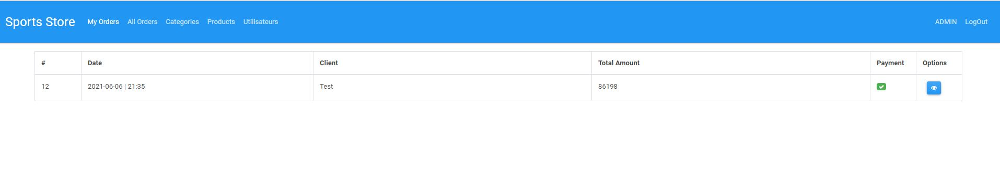
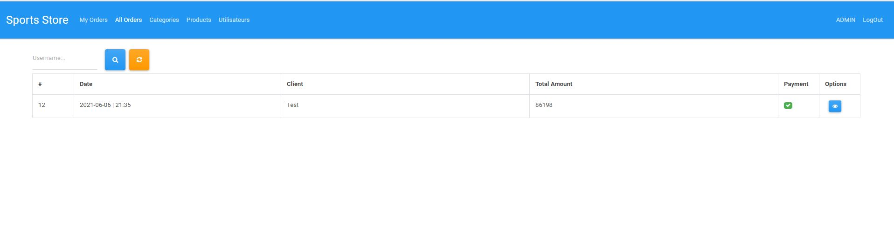
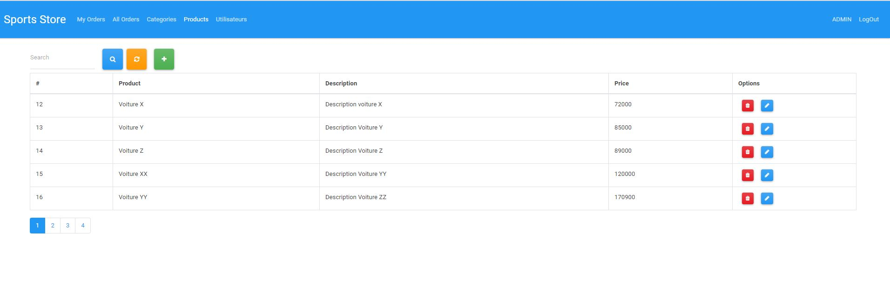
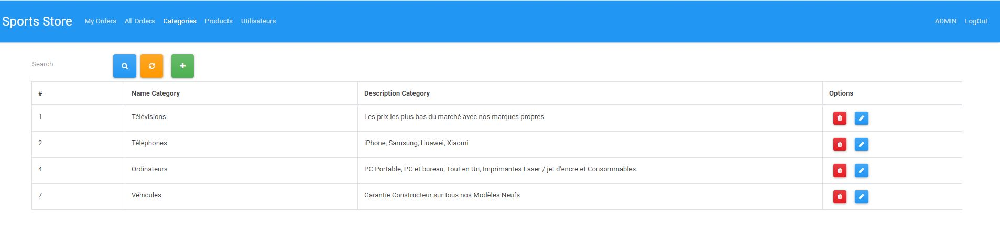

# Sports Store

A simple project commerce back-end to manage the Products by categories with a simples interfaces :

<b> Sign Up :  </b>
 

 
<b> Sign In :  </b>
 

 

<b> Default Interface for a admin :  </b>
 

 

<b> Default Interface for a simple user :  </b>
 

 

<b> Profile Interface :  </b>
 

 

<b> My Orders interface (Simple User - Admin) :  </b>
 

 

<b> All Orders interface (Admin) :  </b>
 

 

<b> Users manage interface (Admin) :  </b>
 

 
<b> Products manage interface (Admin) :  </b>
 

 
<b> Categories manage interface (Admin) :  </b>
 

